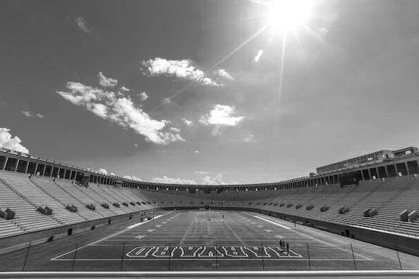
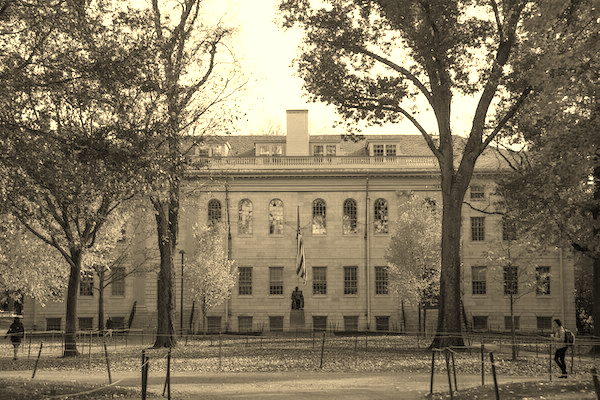
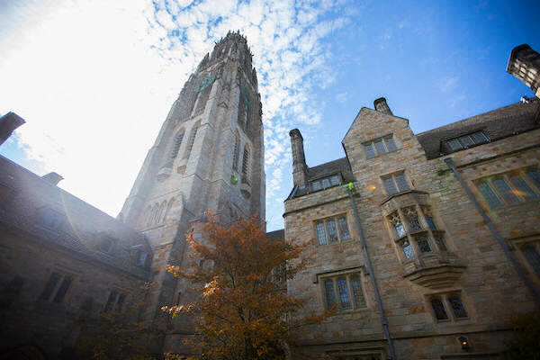
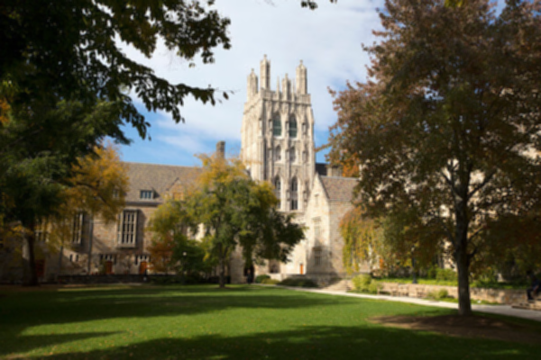
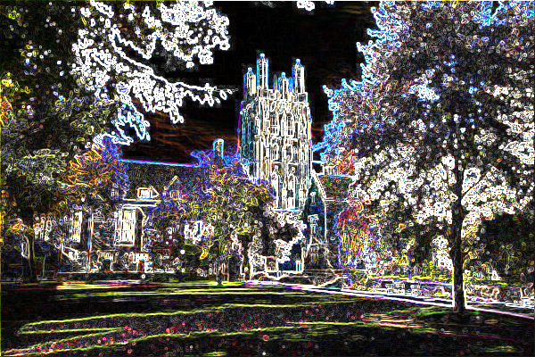
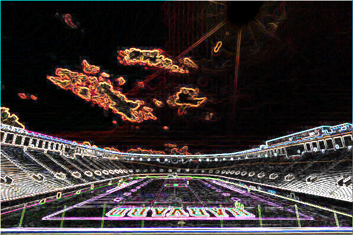
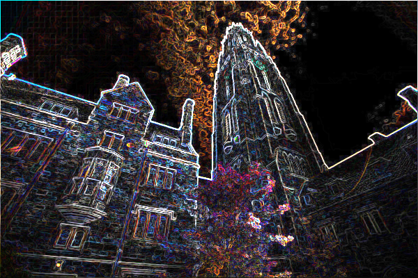
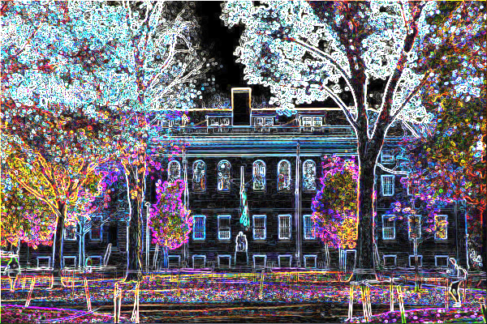

# Java Filter

CS50s 4th week assignment was to implement several filters for .bmp images in C. I had so much fun figuring out how to code that in C, that i decided to try and code up something similar in JAVA from scratch. 

The filters are grayscale, sepia, reflect, blur, and edges.

Grayscale and sepia turn the entire picture into a black-and-white 
and a sepia version of the same image. The reflect filter reflects the image on 
the vertical axis and blur will blur the image in a 3x3 pixel grid, so it is a soft blur. 
Edges highlights the edges. 

## Folder Structure

The workspace contains six folders by default, where:

- `.vscode`: the folder that contains some simple json settings
- `bin`: the folder to contain the filter.class
- `filterResults`: the folder to contain some examples
- `img`: the folder with the CS50's original bmp files to week 4's assignment
- `lib`: the folder to maintain dependencies
- `src`: the folder to maintain sources

Meanwhile, the compiled output files will be generated in the `img` folder by default as "**output.bmp**".

## Examples

- ### Grayscale

    original image:

    

    filtered result: 

    

- ### Sepia

    original image:

    

    filtered result: 

    

- ### Reflect

    original image:

    

    filtered result: 

    

- ### Blur

    original image:

    

    filtered result: 

    

- ### Edges

    Because i like this filter so much, i want to show it on all of the example files.

    The courtyard: 

    

    The stadium: 

    

    The tower: 

    

    The yard:

    

## How to use

This project is for simplicitys sake a pure command line program. Simply run the Filter.java code in the src folder and the Terminal of your IDE will prompt you to first choose an image to be filtered: 

        Please choose one of the following Images:

        "courtyard", "stadium", "tower" or "yard"

        Image name:

It will then tell you if the loading was successfull:
 
        Succesfully loaded in File

or prompt you again if you misspelled one of the predefined filenames.

After it will ask you to choose a filter: 

        Please choose a filter:
        grayscale: "g", sepia "s", reflect: "r", blur: "b", edge: "e"
        Filter: 

If the program was successfull, the filtered file will be saved in the `img` directory as "**output.bmp**". Otherwise it will again prompt you until your input was valid.

        Succesfully print File

Afterwards the program ends itself.